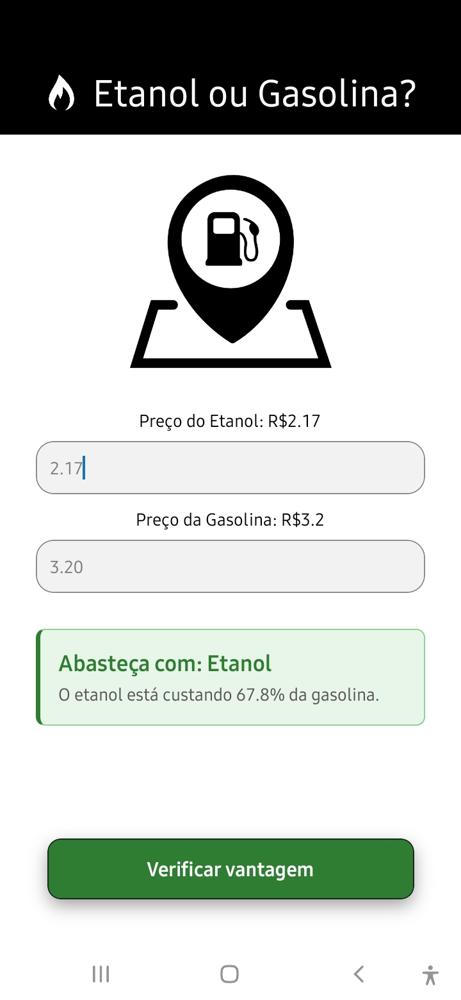
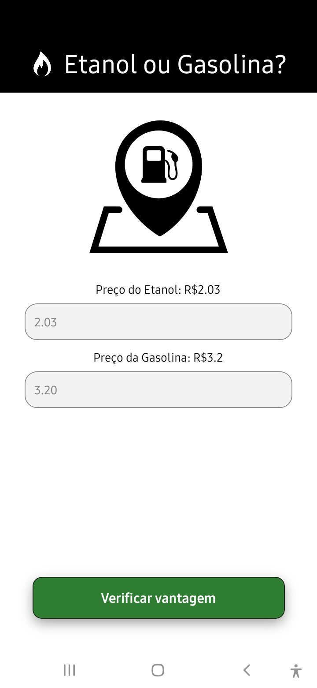
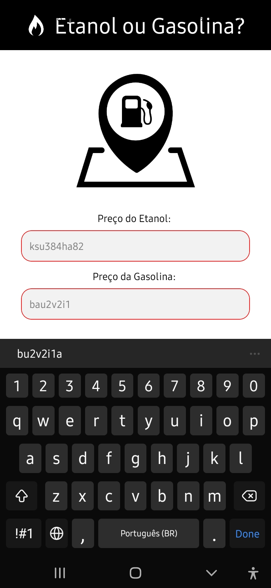

# Aplicativo Combustível Ideal

Projeto desenvolvido como atividade prática de PAM. O aplicativo auxilia o usuário a calcular a melhor opção de abastecimento entre álcool e gasolina.

---

## Demonstração

<div align="left">
  
  
  
</div>

<br clear="left"/>

---

## Tecnologias

* React Native
* Expo
* Node.js

---

## Como Executar o Projeto

Certifique-se de ter o Node.js instalado.

### Passo a Passo

1. Instale as dependências do projeto:
   
   ```bash
   npm install
   ```
3. Rode com o Expo:
   
```bash
   npx expo start
   ```
